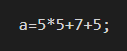
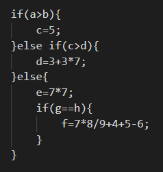

Universidad de San Carlos de Guatemala \
Facultad de Ingeniería \
Escuela de Ciencias y Sistemas \
Catedrático Erick Carlos Roberto Navarro Delgado \
Organización De Lenguajes Y Compiladores 2 

# Examen Corto 2

Estudiante Osmel David Tórtola Tistoj \
Carnet 201404218

## Descripción

Se utilizó la herramienta Jison para la creación de un esquema de 
traducción dirigido por la sintaxis posfijo para un analizador ascendente.
Este analizador recibe operaciones aritméticas y retorna el equivalente en 
código de tres direcciones.

## Detalles Técnicos

### Descripción de los archivos:

- **Analizador.jison:** Este archivo contiene todas las instrucciones para que Jison pueda generar el analizador. Y está compuesto por las siguientes partes:

    - **Definición de código del usuario:** En esta parte se coloca código JavaScript creado por el usuario y debe ir encerrado por `%{ }%`. En este caso se creó un atributo `contador` para llevar la cuenta de los atributos temporales que se han creado. También se creó la función `new_temp()` la cuál se encarga de devolvernos un string de la forma `T` + `numero`, donde el número es el valor de contador. *Por ejemplo "T0", "T1", etc.*  
    
    

    - **Definición de expresiones regulares y símbolos:** Se le indica a Jison las expresiones regulares y los símbolos que pertenecen al lenguaje. En base a estas definiciones, Jison generará un analizador léxico para reconocer tokens. Este lenguaje recibe identificadores, números y símbolos aritméticos.
    
    

    - **Definición de la gramática:** Acá se colocan todas las producciones de la gramática junto con sus atributos y esquemas de traducción. Usando esta información, Jison generará un analizador sintáctico y realizará las acciones que le especifiquemos. En este caso se escribió la gramática para un *análisis descendente*.
    
    
    

- **Analizador.js:** Jison es el encargado de escribir este archivo, en el cual se crean los analizadores léxicos y sintácticos en base al contenido del documento **Analizador.jison**. Este es el archivo que ejecutaremos posteriormente para poder utilizar el analizador. No es necesario modificar este documento a mano, ya que Jison hace todo el trabajo por nosotros.
    
    

- **probarAnalizador:** Este es un archivo de texto plano en el cual escribimos la información que queremos enviar a nuestro análisis. También es posible enviar el texto directamente al analizador utilizando consola, pero por comódidad lo hacemos en un archivo.

    

### Descripción de la gramática, atributos y esquemas de traducción:

Se utilizó una gramática no ambigua para las operaciones aritméticas básicas, para un analizador descendente. Además, se utilizó esquemas de traducción dirigidas por sintaxis posfija para las operaciones. Las acciones se encargan de convertir estas *operaciones aritméticas* a su equivalente en código de 3 direcciones, auxiliandose de variables temporales. 

Se utilizan 2 atributos sintetizados: `tmp` y `c3d`. `tmp` es el atributo que lleva la información de los valores, por ejemplo un número o identificador, mientras se decide la estructura de 3 direcciones que se utilizará. 

Cuando se encuentra una operación, se construye el código en 3 direcciones concatenando al código en 3 direcciones que traen los nodos en su atributo `c3d` junto con la información que traen los nodos en sus atributos `tmp` y el resultado se guarda en `c3d` del padre, de esta manera, se va construyendo las acciones de 3 direcciones de manera ascendente, hasta llegar al último nodo y en este se imprime código.

## Cómo utilizar el programa

1. Instalar Node.js: https://nodejs.org/en/download/current/ (Se usará node para instalar Jison y para ejecutar el analizador)
2. Instalar Jison: `npm install jison -g` (Esto es solo necesario para poder generar el archivo Analizador.js, si ya se cuenta con este archivo y sólo se quiere ejecutar, no hace falta tener instalado jison).
3. Generar el analizador utilizando Jison: `jison Analizador.jison`
4. Escribir en probarAnalizador la entrada deseada, o desde consola con el comando: `echo (a + b) * (a + c) > probarAnalizador`
5. Ejecutar nuestro analizador y enviarle como entrada el contenido de probarAnalizador: `node Analizador.js probarAnalizador`

## Ejemplos:

1. **[(a + b) * (a + c)]** \

2. **[x * x]** \

3. **[y * y]** \

4. **[x2 + y2]** \

5. **[b + c + d]** \

6. **[a * a + b * b]** \

7. **[5 + 2 * b]** \

8. **[6 + 7 * 10 + 5 / 1]** \

9. **[((7 + 9)/(((3 + 1) * (6 + 7) + 8) * 7) / 9) + 100]** \

10. **[7 * 9 - 89 + 63]** \

