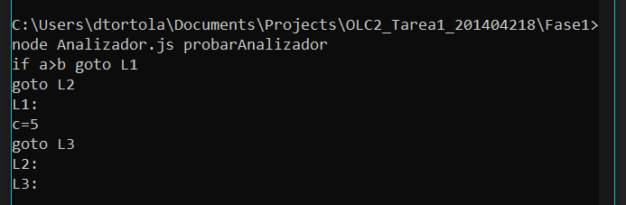

Universidad de San Carlos de Guatemala \
Facultad de Ingeniería \
Escuela de Ciencias y Sistemas \
Catedrático Erick Carlos Roberto Navarro Delgado \
Organización De Lenguajes Y Compiladores 2 

# Tarea 1

Estudiante Osmel David Tórtola Tistoj \
Carnet 201404218

## Descripción

Este proyecto es continuacion de [Examen Corto 2](https://github.com/DavidTortola/OLC2_Corto2_201404218), y expande el lenguaje para que incluya, además de `operaciones aritméticas`, `asignaciones`, condiciones `if`, `else if` y `else`. También soporta anidación de estos, es decir una condición `if` dentro de otra. El analizador devuelve como salida el equivalente en código de 3 direcciones, utilizando símbolos temporales, etiquetas y saltos para cumplir con los `if`.

El proyecto se divide en dos fases.

---
# Fase 1
---

Esta fase consiste en la construcción del código de 3 direcciones del lenguaje reconocido, utilizando la herramienta Jison y esquemas de traducción dirigidos por la sintaxis posfijo, sintetizando los valores hasta finalmente llegar al a raíz, donde se imprime en consola el código producido.

## Detalles Técnicos

### Gramática

La gramática utilizada para el analizador es recursiva por la izquierda para un análisis ascendente. Reconoce sentencias if, recursivos else if y finalmente puede o no puede venir un else. Dentro de cada if, pueden venir otras sentencias if o asignaciones. Las asignaciones constan de un identificador seguido de un signo igual y posteriormente una expresion aritmética.

### Esquemas de traduccion y atributos 

En los esquemas de traduccion se utilizan 3 atributos: `tmp` para las operaciones aritmeticas, nos sirve para mover los valores temporalmente, mientras decidimos la instruccion de 3 direcciones adecuada para la operacion. `c3d` es la cadena donde concatenamos el codigo en 3 direcciones que finalmente imprimiremos al llegar al a raíz. `salida` es un atributo en el cual vamos concatenando las etiquetas de salida, para poder colocarlas al finalizar todos los `if`.

En el esquema de traduccion para la produccion `S -> W EOF` se imprime el codigo de 3 direcciones que trae el símbolo `W`, mientras que `W` es utilizado para la recursividad y poder reconocer múltiples ifs y asignaciones seguidos.

El símbolo `V` reconoce las instrucciones if y las instrucciones de asignacion. Sus esquemas de traduccion se encargan de concatenar el codigo de 3 direcciones que puede haberse producido en el símbolo `W` y en el símbolo `ELSEIF`, para posteriormente ordenarlo y colocar las etiquetas de salida al final de la instruccion if.

El símbolo `ELSEIF` se encarga de realizar la recursividad para los else if, pudiendo terminar en un else o simplemente en una llave `}`. En sus instrucciones, se encarga de generar las etiquetas de los saltos y en su atributo `salida` ir concatenando las etiquetas de salida, para que al finalizar se puedan imprimir.

## Cómo utilizar el programa

1. Instalar Node.js: https://nodejs.org/en/download/current/ (Se usará node para instalar Jison y para ejecutar el analizador)
2. Instalar Jison: `npm install jison -g` (Esto es solo necesario para poder generar el archivo Analizador.js, si ya se cuenta con este archivo y sólo se quiere ejecutar, no hace falta tener instalado jison).
3. Generar el analizador utilizando Jison: `jison Analizador.jison`
4. Escribir en probarAnalizador la entrada deseada, o desde consola con el comando: `echo (a + b) * (a + c) > probarAnalizador`
5. Ejecutar nuestro analizador y enviarle como entrada el contenido de probarAnalizador: `node Analizador.js probarAnalizador`

## Ejemplos:

1. 

2. 

3. 

4. 

